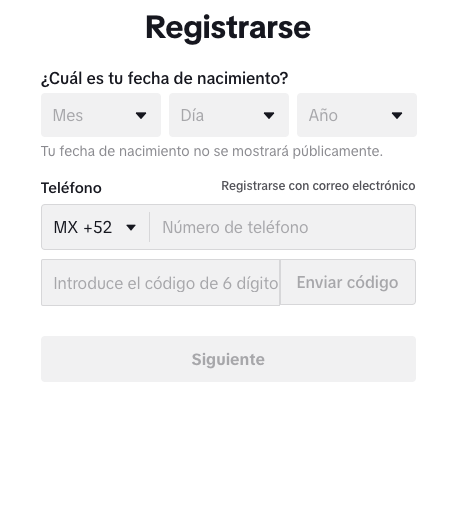

[Inglés](#Instructions-exercise-05)

[Español](#Instrucciones-ejercicio-05)

# Instructions-exercise-05

1. Create HTML5 tags, inside the **index.html** file.

2. Inside the `<body>` tag, create a form with the following data.

   - First name
   - Last name
   - Age
   - Sex (put both sexes and be able to select any of the two)
   - Date of birth (in this field you will have to be able to choose day, month and year).
   - Address
   - Occupation
   - Country
   - Remarks (this field should have a text area)

3. In other branches make forms as shown in the following images.

# Reminder

- A branch of `develop-[name]` must be output, as we have done in previous exercises.

- Name of the branches must always comply with the following conventions

---

# Instrucciones-ejercicio-05

1. Crear etiquetas de HTML5, dentro del archivo **index.html**.

2. Dentro de la etiqueta `<body>`, crear un formulario con los campos que se dejaran enseguida.

   - Nombre
   - Apellido
   - Edad
   - Sexo (poner ambos sexos y poder seleccionar cualquiera de los dos)
   - Fecha de nacimiento (en este campo tendrás que poder elegir día, mes y año.)
   - Dirección
   - Ocupación
   - País
   - Observaciones (este campo debera tener un área de texto)

3. En otras ramas realizar formularios como se muestran en la siguientes imagenes.

# Recordatorio

- Debe salir una rama de `develop-[nombre]`, como lo hemos hecho en ejercicios anteriores

- Nombre de las ramas siempre debe cumplir con las convensiones
