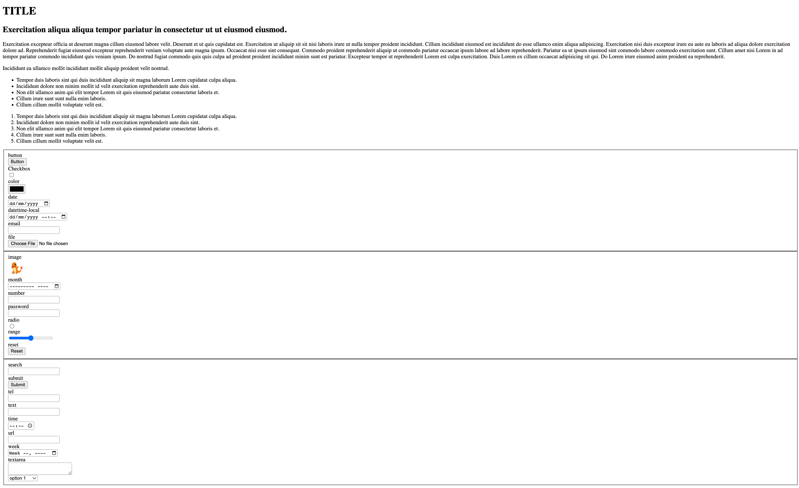

[Español](#Instrucciones)

[English](#Instructions)

# Instructions

1. Create the basic HTML structure tags inside the `index.html` file.

2. Inside the `html` file create a basic web page as the following **(use text, containers and list tags)**.

    > example
    

3. The web page should contain real data. It could be a story, a resume, a storyteller, etc.

# Reminder

- A branch of `develop-[name]` must be output, as it has been done in previous exercises.

- Name of the branches must always comply with the following conventions.

---

# Instrucciones

1. Crear la estructura básica de HTML dentro del archivo `index.html`.

2. Dentro del archivo `html` crear una página web como la siguiente **(usar etiquetas de texto, contenedores y listas)**.

    > ejemplo
    

3. La página web debe contener información real. Puede ser una historia, un resumen, un cuento, etc.

# Recordatorio

- Debe salir una rama de `develop-[nombre]`, como se ha realizado en ejercicios anteriores.

- Nombre de las ramas siempre debe cumplir con las convensiones.
