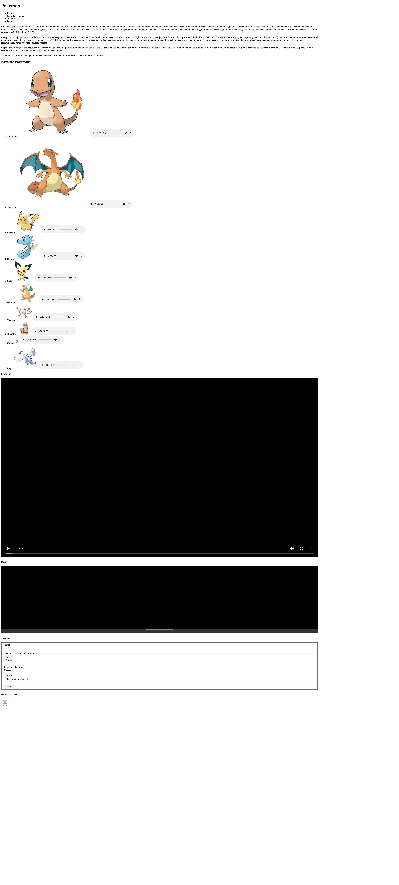

[Español](#Instrucciones)

[English](#Instructions)

---

# Instructions

1. Create the basic HTML structure inside the `index.html` file.

2. Inside the `html` file recreate the example .

3. The content should be more structure, include containers, text, lists and form tags.

# Reminder

- You must output a branch of `develop-[name]`, as it has been done in previous exercises.

- Branch names must always comply with the following conventions

---

# Instrucciones

1. Crear la estructura básica de HTML dentro del archivo `index.html`.

2. Dentro del archivo `html` recrear el ejemplo .

3. El contenido debe estar más estructurado, incluir etiquetas de contenedores, texto, listas y formularios.

# Recordatorio

- Debe salir una rama de `develop-[nombre]`, como se ha hecho en ejercicios anteriores

- Nombre de las ramas siempre debe cumplir con las convenciones
